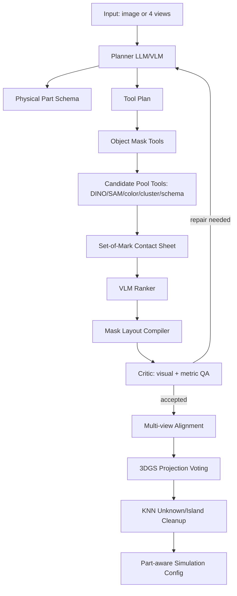

# PartPhysAgent: Agentic Part Segmentation Design

## Why the current system still feels like a pipeline

The current PartPhysAgent already has useful tools: object masking, DINO/SAM candidate generation, VLM candidate ranking, multi-view mask alignment, Gaussian assignment, and KNN cleanup. However, these tools are executed mostly in a fixed order. A stronger contribution is to present the system as a closed-loop visual agent:

1. It reasons about the object and the physically meaningful parts.
2. It chooses segmentation tools and parameters.
3. It inspects visual evidence and quality metrics.
4. It repairs failure modes such as missing parts, background leakage, plate/body confusion, tiny islands, and unknown residuals.
5. It lifts validated masks to 3DGS and performs spatial consistency cleanup.

This is the main distinction: a pipeline executes stages; an agent keeps state, chooses actions, evaluates outcomes, and iterates.

## Related agent design patterns

### ReAct-style reason-act loop

ReAct frames an LLM agent as alternating reasoning traces and tool actions. For part segmentation, this maps naturally to:

- Thought: identify likely physical parts and possible failure cases.
- Action: call detector/SAM, build candidate sheet, ask VLM to rank candidates, run mask repair.
- Observation: read quality metrics and overlays.
- Next action: retry with different prompts, thresholds, or cleanup tools.

### Reflexion-style self-critique

Reflexion introduces a critic/memory loop where failed attempts produce verbal feedback for future attempts. For PartPhysAgent, every segmentation round should produce a compact critique:

- missing parts
- oversized part masks
- tiny masks
- unknown residual ratio
- mask overlap
- multi-view inconsistency
- 3DGS assignment islands

The critique becomes the next round's plan.

### Multimodal tool-using agents

LLaVA-Plus and similar multimodal agents treat external vision models as tools. This matches our setting well: the VLM should not directly output masks. Instead, it should decide how to use tools such as GroundingDINO, SAM, contact-sheet ranking, and geometric cleanup.

### Set-of-Mark / candidate-sheet grounding

Set-of-Mark prompting makes VLM grounding easier by drawing candidate labels directly on the image. Our contact sheet is already close to this. The agent should use candidate IDs as action targets instead of asking the VLM to invent coordinates.

### Programmatic visual reasoning

ViperGPT-style systems use LLMs to compose executable vision operations. In PartPhysAgent, the action space should be constrained to safe symbolic operations:

- `generate_object_mask`
- `generate_part_candidates`
- `rank_candidates`
- `compile_layered_layout`
- `repair_object_mask`
- `repair_part_mask`
- `align_multiview_parts`
- `assign_gaussians`
- `knn_cleanup`

The LLM chooses actions and parameters, but deterministic code executes them.

### 3DGS part lifting and KNN cleanup

Resonance4D describes lifting multi-view semantic masks to 3D Gaussians and then applying KNN post-processing to suppress isolated noisy points. This is directly applicable to PartPhysAgent: 2D part masks are uncertain near boundaries, but 3D neighboring Gaussians should usually share a part label.

## Proposed agent architecture



## Agent state

The agent should maintain an explicit JSON state under `agent_logs/agent_state.json`:

```json
{
  "object": "cake",
  "views": ["front", "right", "rear", "left"],
  "round": 1,
  "part_schema": [],
  "tool_plan": [],
  "candidate_summary": {},
  "selected_parts": [],
  "quality": {},
  "critic": {},
  "repairs": [],
  "assignment": {}
}
```

This state makes the method auditable and paper-friendly.

## Implemented agent mode

The code now exposes an opt-in closed-loop mode:

```bash
python partphys_pipeline.py ... --agent-mode agent --agent-rounds 2 --multiview-dir /path/to/4views
```

With the Qwen/OpenAI-compatible endpoint:

```bash
export DASHSCOPE_API_KEY=your_key_here
python partphys_pipeline.py ... \
  --agent-mode agent \
  --agent-rounds 2 \
  --multiview-dir /path/to/4views \
  --vlm-provider openai_compatible \
  --vlm-model qwen3.7-plus \
  --vlm-api-base https://llm-jrkem52i075alacx.cn-beijing.maas.aliyuncs.com/compatible-mode/v1 \
  --vlm-api-key-env DASHSCOPE_API_KEY
```

Implemented components:

- `partphys/part_seg_agent.py`: controller for planner, critic, repair-round policy, multi-view evidence, and auditable state.
- `partphys/agent.py`: wires the controller into the segmentation loop and records multi-view alignment quality after four-view segmentation.
- `partphys/vlm.py`: adds planner and critic methods for OpenAI-compatible VLM endpoints.
- `partphys/prompts.py`: adds strict planner/critic JSON prompts with multi-view identity constraints.

The current agent is organized as five explicit modules:

1. Planner: produces a physically meaningful part schema and tool plan from single-view or four-view evidence.
2. Tool executor: runs deterministic tools only, including object masking, DINO/SAM candidate generation, candidate-sheet ranking, layout compilation, multi-view segmentation, 3DGS projection voting, and KNN cleanup.
3. Critic: inspects overlays plus metrics and returns strict JSON failure modes and repair actions.
4. Repair policy: compiles repair actions into deterministic next-round parameters, such as larger candidate pools, schema-location proposals, stricter layout compilation, VLM bbox proposals, or unknown fill-nearest.
5. Memory/trace: writes planner evidence, executed tool actions, per-round quality, critic output, repair actions, overrides, action trace, and final acceptance to `agent_logs/agent_state.json`.

The repair policy also includes deterministic spatial priors inferred from each `PartSpec`, not from a fixed object category. For bottom-support/contact parts, the selected mask is constrained to the lower support region before residual filling. For small or thin parts, such as labels, signs, laces, candles, handles, or other decorations, the part is allowed to remain independent, but its mask is constrained by the planner-provided location and shape prior so it cannot absorb the main body. During `fill_unknown_by_nearest_part`, residual pixels are assigned with these part priors in mind instead of blindly using the closest centroid.

Residual parts such as `unknown_body` are treated as cleanup artifacts rather than stable semantic parts. They may be useful for debugging or temporary repair, but they are excluded from mandatory multi-view identity matching.

The action space is intentionally finite:

```json
[
  "generate_part_candidates",
  "rank_candidates",
  "rerank_candidates",
  "rerun_with_schema_location_proposals",
  "repair_object_mask",
  "repair_part_mask",
  "compile_layout",
  "fill_unknown_by_nearest_part",
  "increase_candidate_pool",
  "multiview_align",
  "knn_cleanup"
]
```

For multi-view input, the agent now also performs view-level repair. If a non-canonical view misses aligned parts or fails quality checks, it can rerun that view with repair overrides before accepting the final `view_masks`.

When `--multiview-dir` is available, the planner receives a labeled 2x2 evidence image:

```text
front | right
rear  | left
```

After per-view segmentation, the agent writes `agent_logs/multiview_part_overlay.png` and records a final multi-view critic report. A part is treated as the same physical part across views by `part name / physics_group`, not by 2D mask shape.

Main output files:

- `agent_logs/agent_state.json`: planner output, executed tool actions, per-round quality, critic feedback, repair choices, overrides, action trace, and final acceptance.
- `agent_logs/planner_multiview_evidence.png`: multi-view image sheet used by the planner.
- `agent_logs/multiview_segmentation_summary.json`: per-view matched/missing part masks.
- `agent_logs/multiview_part_overlay.png`: final four-view overlay used by the critic.

## Roles

### 1. Planner

Input:

- object name
- one or four views
- optional previous critique

Output:

- physically meaningful part schema
- prompt variants per part
- expected location and shape priors
- part merge/split rules
- selected tool strategy

Example planner action:

```json
{
  "parts": ["cake_base", "frosting_layer", "strawberries", "plate"],
  "strategy": {
    "object_mask": "background_foreground_union_if_sam_incomplete",
    "candidate_sources": ["text_box_sam", "sam_auto", "color_prior", "appearance_cluster"],
    "use_multiview": true,
    "residual_policy": "unknown_then_knn_reassign"
  }
}
```

### 2. Tool Executor

Runs deterministic tools only. The LLM never writes masks directly.

Recommended tools:

- GroundingDINO object/part boxes
- SAM2 box prompts and automatic masks
- color priors for known material/color parts
- appearance clustering
- schema-location proposals
- VLM candidate ranking from contact sheets
- mask layout compilation

### 3. Critic

The critic reads overlays and metrics. It returns strict JSON:

```json
{
  "ok": false,
  "failure_modes": [
    "front object mask misses top decorations",
    "cake body leaks into plate",
    "unknown residual too large"
  ],
  "repair_actions": [
    {"action": "repair_object_mask", "view": "front", "method": "foreground_union"},
    {"action": "rerank_candidates", "part": "plate", "penalty": "cake_body_overlap"},
    {"action": "knn_cleanup", "target": "unknown_body"}
  ]
}
```

### 4. Repair loop

The agent should iterate up to a small budget, usually 2-3 rounds:

1. Run segmentation.
2. Compute metrics: coverage, overlap, unknown ratio, tiny parts, semantic issues.
3. Ask critic for repair actions.
4. Apply deterministic repairs or rerun selected tools.
5. Accept when quality gates pass or no useful repair remains.

## Quality gates

Recommended acceptance criteria:

- object mask covers the full visible object in all provided views
- no large background leakage
- selected parts match expected schema names
- `unknown_ratio < 0.05` after repair, except when object truly has unmodeled residual
- part overlap below a threshold, e.g. `< 0.03`
- all required physical parts have at least one valid mask
- 3DGS assignment uses at least two views on average when four views are available
- KNN cleanup removes unknown/island Gaussian labels without erasing small true parts

## Multi-view part identity

Do not align parts by mask shape. Align them by schema identity:

```text
part name / physics_group -> per-view visible mask -> shared 3D part label
```

For example:

```json
{
  "part": "frosting_layer",
  "view_masks": {
    "front": ".../front/frosting/mask.png",
    "right": ".../right/frosting/mask.png",
    "rear": ".../rear/frosting/mask.png",
    "left": ".../left/frosting/mask.png"
  }
}
```

This prevents the agent from treating each view's visible fragment as a different part.

## 3DGS assignment design

The 3D assignment should be agent output, not just a projection utility:

1. Project each Gaussian to all calibrated views.
2. Aggregate category responses from all part masks.
3. Weight hits by part confidence and mask interior distance.
4. Penalize residual/unknown labels.
5. Assign the maximum score label.
6. Run KNN cleanup:
   - reassign `unknown_body` points to nearby real parts when local support is strong
   - suppress isolated labels whose neighbors overwhelmingly belong to another part
7. Store diagnostics:
   - per-view hits
   - average view support
   - margin ratio
   - low-confidence count
   - KNN reassigned unknown count
   - KNN reassigned island count

This follows the spirit of multi-view semantic lifting plus KNN post-processing in Resonance4D.

## How to use Qwen/DashScope in the current code

The current `OpenAICompatibleVLMClient` can use DashScope-compatible endpoints through environment variables and CLI flags.

```bash
export DASHSCOPE_API_KEY="..."

python partphys_pipeline.py \
  --vlm-provider openai_compatible \
  --vlm-model qwen3.7-plus \
  --vlm-api-base https://llm-jrkem52i075alacx.cn-beijing.maas.aliyuncs.com/compatible-mode/v1 \
  --vlm-api-key-env DASHSCOPE_API_KEY \
  --require-vlm \
  ...
```

Do not hard-code the API key in source code.

## Minimum implementation roadmap

### Stage A: make the current pipeline agent-readable

- Write `agent_state.json`.
- Record every round's plan, tool outputs, critic result, and repairs.
- Keep all final outputs unchanged for compatibility.

### Stage B: add planner and critic calls

- Add `plan_part_segmentation(...)` to `vlm.py`.
- Add `critique_part_segmentation(...)` to `vlm.py`.
- Add prompts for strict JSON tool planning and repair actions.

### Stage C: add repair actions

Useful deterministic actions:

- `repair_object_mask_foreground_union`
- `rerun_with_vlm_bbox_proposals`
- `rerun_with_schema_location_proposals`
- `increase_candidate_top_k`
- `suppress_plate_body_confusion`
- `fill_unknown_by_nearest_part`
- `knn_cleanup_3d_labels`

### Stage D: paper contribution framing

Name the method something like:

**PartPhysAgent: A Tool-Using Multi-View VLM Agent for Physical Part Decomposition of 3D Gaussians**

The contribution can be stated as:

1. A physical-part-oriented VLM agent that plans object decomposition by material/physics rather than pure semantics.
2. A visual tool loop combining DINO/SAM, candidate-sheet VLM ranking, deterministic mask repair, and critic-guided retry.
3. A multi-view schema-aligned part identity mechanism for consistent part labels across views.
4. A 2D-to-3DGS assignment module with multi-view voting and KNN cleanup for isolated part-label noise.

## Notes for the cake example

The current cake result shows why the agent formulation matters:

- A pipeline accepted a front object mask that missed top decorations.
- A critic would identify "object mask misses visible strawberries/cream" before downstream assignment.
- A repair action would replace incomplete SAM object mask with background-derived full foreground.
- KNN cleanup then removes small 3DGS label islands and reassigns `unknown_body`.

This is a concrete case study for the paper.
